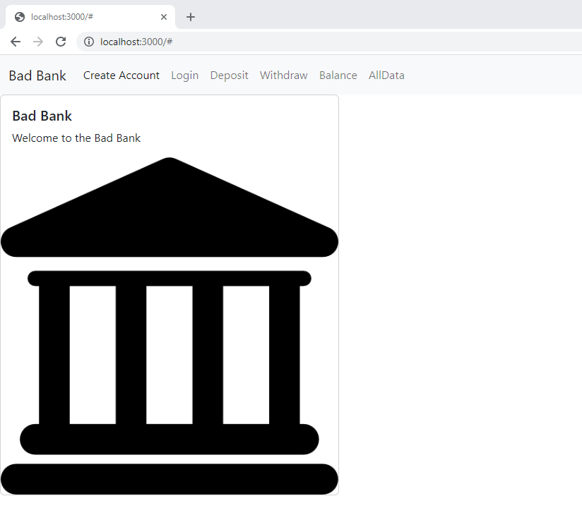

# Bad Bank Project - Full Stack

## Description
This is the three-tiered version of the Bad Bank project for the MIT xPro certification program. It showcases the entire full stack implementation connecting the frontend GUI, the http server, and the database.

## Installation
1. run a MongoDB Docker image.
    - `docker run -p 27017:2701 --name badbank -d mongoDB`

2. clone the Bad Bank repository.
    - `git clone https://github.com/dorenel/bad-bank-full-stack.git`

3. build the project.
    - `npm install`

4. start the server.
    - `node index.js`

5. navigate to the GUI.
    - point the broswer to `http://localhost:3000`

## Screenshots
Home screen:

Create account screen:

Login screen:

Deposit screen:

Withdraw screen:

Check balance screen:

All data screen:

## Technologies
***Front End***
- HTML
- JavaScript
- Bootstrap
- React

***Back End***
- Express
- MongoDB
- Docker
- Firebase (Authentication)

## Features
***Current Features***
- create accounts
- login
- make deposits
- make withdrawals
- check balance
- list all the existing accounts.

***Future Roadmap***
- authentication
- authorization
- stylize the app

## License

    MIT License

    Copyright (c) 2022 dorenel

    Permission is hereby granted, free of charge, to any person obtaining a copy
    of this software and associated documentation files (the "Software"), to deal
    in the Software without restriction, including without limitation the rights
    to use, copy, modify, merge, publish, distribute, sublicense, and/or sell
    copies of the Software, and to permit persons to whom the Software is
    furnished to do so, subject to the following conditions:

    The above copyright notice and this permission notice shall be included in all
    copies or substantial portions of the Software.

    THE SOFTWARE IS PROVIDED "AS IS", WITHOUT WARRANTY OF ANY KIND, EXPRESS OR
    IMPLIED, INCLUDING BUT NOT LIMITED TO THE WARRANTIES OF MERCHANTABILITY,
    FITNESS FOR A PARTICULAR PURPOSE AND NONINFRINGEMENT. IN NO EVENT SHALL THE
    AUTHORS OR COPYRIGHT HOLDERS BE LIABLE FOR ANY CLAIM, DAMAGES OR OTHER
    LIABILITY, WHETHER IN AN ACTION OF CONTRACT, TORT OR OTHERWISE, ARISING FROM,
    OUT OF OR IN CONNECTION WITH THE SOFTWARE OR THE USE OR OTHER DEALINGS IN THE
    SOFTWARE.
